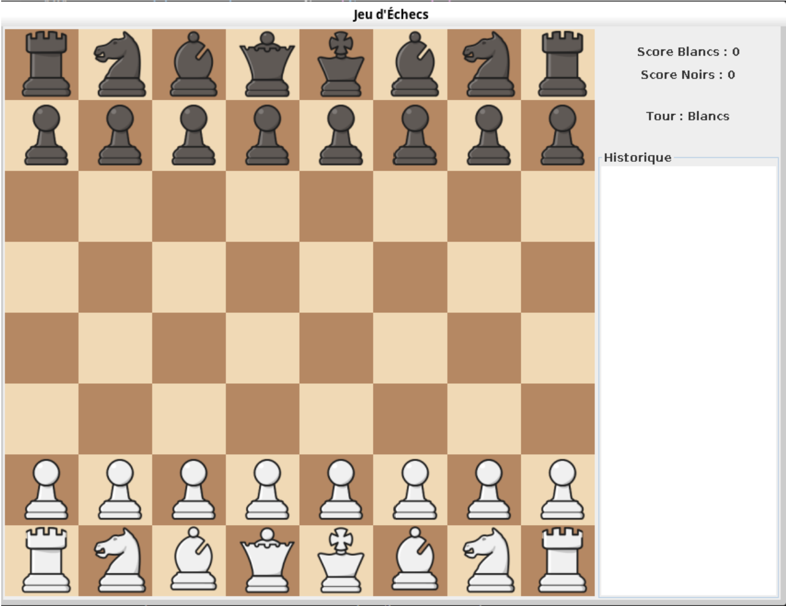
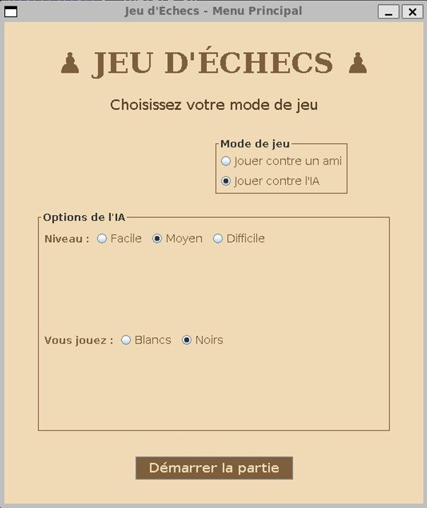
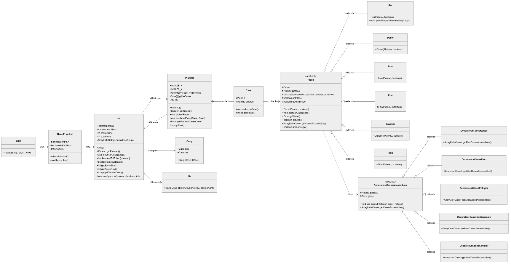

# Jeu d'Échecs en Java

*Interface du jeu*

## Introduction

Ce projet implémente un jeu d'échecs en Java, permettant de jouer selon les règles classiques avec une interface graphique intuitive. Les joueurs peuvent jouer contre l'intelligence artificielle (IA) avec trois niveaux de difficulté : facile, moyen, et difficile.

## Lancer le projet 

- **Vérification de Java** : `java -version` permet de vérifier que Java est installé sur la machine.
- **Compilation avec `javac`** : `javac Main.java` compile le fichier source.
- **Exécution avec `java`** : `java Main` exécute le programme compilé.

## Fonctionnalités

### Règles des Échecs
L'implémentation couvre toutes les règles classiques des échecs, notamment :
- Déplacements spécifiques à chaque type de pièce
- Captures de pièces
- Échec et échec et mat
- Match nul par pat ou après répétition de trois situations égales
- Roque (petit et grand)
- Prise en passant
- Promotion des pions

### Intelligence Artificielle
L'IA comporte trois niveaux de difficulté :
- **Facile** : L'IA joue des coups aléatoires parmi les coups légaux
- **Moyen** : L'IA privilégie les captures avantageuses
- **Difficile** : L'IA évalue les positions et cherche des coups stratégiques.

### Interface Graphique
L'application dispose d'une interface graphique avec :
- Un menu principal pour choisir le mode de jeu (contre un ami ou contre l'IA)
- Un panneau d'information affichant le score et l'état du jeu
- Un historique des coups joués
- Mise en évidence des cases accessibles lors de la sélection d'une pièce
- Des dialogues pour la promotion des pions et l'annonce de fin de partie

*Menu*

## Architecture

Le projet utilise plusieurs **patterns de conception** pour organiser le code :
- **Modèle MVC** : Séparation des responsabilités entre la logique du jeu (modèle), l'affichage graphique (vue), et le contrôleur des interactions utilisateur.
- **Décorateur** : Gestion des règles de déplacement des pièces (roque, prise en passant, etc.)
- **Observer** : Maintien de la synchronisation entre la vue et l'état du jeu.

### Classes Principales
- **Jeu** : Gère le déroulement de la partie
- **Plateau** : Représente l'échiquier
- **Piece** et ses sous-classes (Roi, Dame, etc.) : Définissent le comportement des pièces
- **IA** : Implémente l'intelligence artificielle

*Diagramme des classes*

## Difficultés Rencontrées

- **Implémentation des règles spéciales** : Le roque et la prise en passant ont posé des défis, mais ont été résolus avec l'utilisation de décorateurs spécifiques et de méthodes spécialisées.
- **Détection de l'échec et mat** : La vérification des situations d'échec a nécessité de simuler tous les coups possibles.
- **Conception de l'IA** : L'IA a été développée avec trois niveaux de difficulté, utilisant une approche par évaluation des positions.

