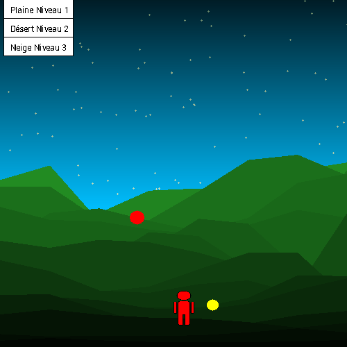
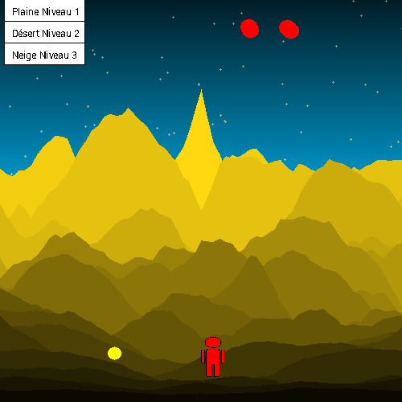
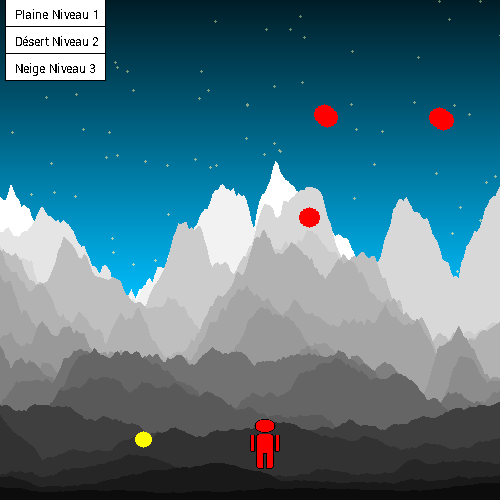

# Génération de Terrain Aléatoire - Bruit de Perlin

Ce projet a été réalisé dans le cadre d'un mini-projet de génération de terrain aléatoire. Il utilise le **bruit de Perlin** pour générer des paysages variés et un jeu où l'objectif est de collecter des pièces tout en évitant les obstacles.

Le projet a été développé avec **Code::Blocks** et utilise la bibliothèque **Grapic**. Pour plus d'informations sur cette bibliothèque, consultez la documentation officielle [ici](https://perso.liris.cnrs.fr/alexandre.meyer/grapic/html/).

## Fonctionnalités du Jeu

- **Objectif du jeu** : Collecter 30 pièces (petits cercles jaunes) tout en évitant les balles (cercles rouges) qui se déplacent aléatoirement. Le personnage (un bonhomme rouge) se déplace de gauche à droite pour attraper les pièces.
- **Commandes** : Déplacez le personnage avec les flèches gauche et droite.
- **Niveaux** : Il existe trois niveaux avec des paysages différents et un nombre croissant de balles à éviter :
  - **Niveau 1 : Plaine** (1 balle)
  - **Niveau 2 : Désert** (2 balles)
  - **Niveau 3 : Neige** (3 balles)

Le jeu est dynamique, avec des mondes générés aléatoirement à l'aide du bruit de Perlin pour créers des paysages réalistes.

## Images du jeu

Voici quelques captures d'écran montrant les différents paysages du jeu :

*Plaine (Niveau 1)*

*Désert (Niveau 2)*

*Neige (Niveau 3)*

## Fonctionnement du Code

### Structures utilisées
Le code est organisé autour de plusieurs structures pour gérer les objets du jeu :

- **Complex** : Sert à gérer les positions et les forces appliquées.
- **Altitude** : Permet de déterminer l'altitude des montagnes.
- **Couleur** : Définit la couleur des montagnes.
- **Montagne** : Représente la montagne.
- **Perso** : Définit le personnage (le bonhomme rouge).
- **Particule** : Représente les balles à esquiver.
- **Piece** : Définit les pièces à collecter.
- **Monde** : Regroupe tous les éléments du jeu.

### Initialisation du monde
Le monde est initialisé en fonction du niveau choisi par l'utilisateur. Selon le niveau (plaine, désert ou neige), le nombre de montagnes et de particules (balles) varie. La génération du monde se fait via la fonction `mondeInit_*` (par exemple, `mondeInit_plaine` pour la plaine).

### Mise à jour du jeu
La fonction `update` est utilisée pour mettre à jour l'état du jeu à chaque itération. Elle gère le déplacement du personnage, les mouvements des balles et la gestion de la friction pour rendre le jeu plus dynamique.

### Dessin du monde
Le dessin du monde se fait via la fonction `mondeDraw`. Elle dessine les montagnes, le personnage, les balles et les pièces sur l'écran. Un dégradé de fond est généré avec la fonction `backgroundDraw`.

## Références

- [Bruit de Perlin sur Wikipédia](https://fr.wikipedia.org/wiki/Bruit_de_Perlin)
- Code de base utilisé : [Examen CCF 2020 - Terrain Bruit Perlin](https://perso.liris.cnrs.fr/alexandre.meyer/teaching/LIFAMI/examens/2020_LIFAMI_CCF_TerrainBruitPerlin.pdf)
- Tutoriel pour comprendre le bruit de Perlin : [SDZ - Bruit de Perlin](http://sdz.tdct.org/sdz/bruit-de-perlin.html)

## Historique des évolutions

### 1ère séance : 07/04/2023
- Création des différents biomes (Savane, Plaine, Neige).
- Début de l'intégration du mouvement du personnage.

### 2ème séance : 21/04/2023
- Ajout des trois biomes fonctionnels : Plaine, Désert, Neige.
- Création du menu de sélection des niveaux.

### 3ème séance : 28/04/2023
- Développement de la fonction `update` pour gérer le déplacement du personnage.
- Ajout des règles de jeu et gestion de la collecte des pièces et des balles.

