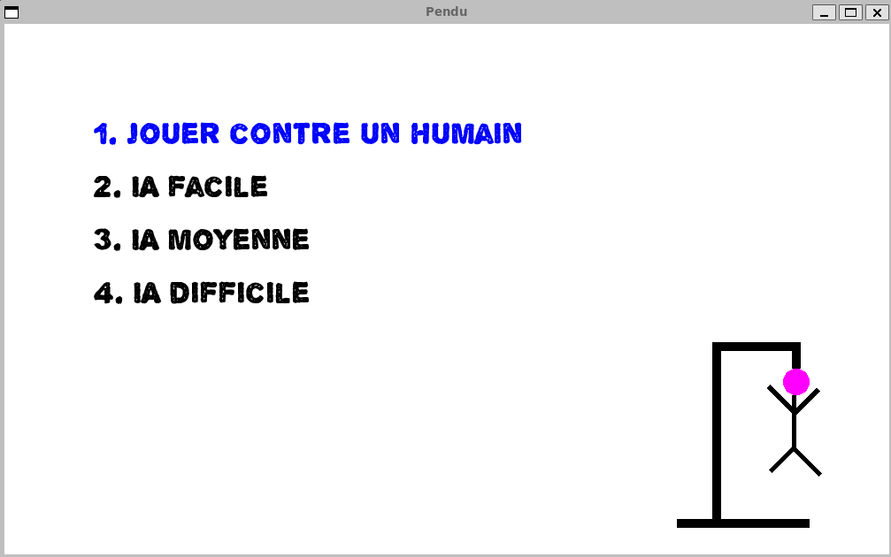
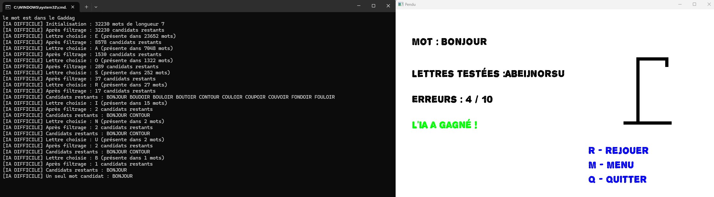

# Jeu du Pendu

## Présentation du projet

Ce projet est une implémentation du jeu du Pendu en C++, avec une interface graphique réalisée à l’aide de la bibliothèque SFML. Il propose quatre modes de jeu :
- Contre un autre joueur humain
- Contre une IA facile
- Contre une IA moyenne
- Contre une IA difficile

L’objectif principal était d’explorer différentes stratégies d’intelligence artificielle pour le jeu du Pendu, en partant d’un comportement aléatoire jusqu’à une IA basée sur une approche statistique et de filtrage lexical.

## Compilation et lancement

### Prérequis

- Un compilateur C++ compatible C++17 ou supérieur
- La bibliothèque SFML (version 2.5 ou équivalent)
- Un fichier `dico.txt` dans le dossier `data/` contenant une liste de mots (en majuscules, un par ligne)
- La police `alpha_echo.ttf` dans le même dossier pour l'affichage graphique

### Compilation

`make`

### Exécution

`./pendu`

## Description des différents modes IA

### IA Facile

L’IA facile choisit une lettre aléatoirement parmi celles qui n’ont pas encore été essayées. Elle ne prend en compte ni la structure du mot, ni les lettres déjà trouvées.

`char choisirLettreIAFacile(const std::set<char>& lettresEssayees);`

### IA Moyenne

L’IA moyenne utilise une pondération des lettres basée sur leur fréquence d’apparition en français. Elle effectue un tirage aléatoire biaisé, favorisant les lettres fréquentes telles que E, A, I, S, N, R, etc.

`char choisirLettreIAMoyenne(const std::set<char>& lettresEssayees, const std::string& masque);`

### IA Difficile

L’IA difficile repose sur une stratégie plus avancée, fondée sur l’exploitation d’un dictionnaire de mots. Elle fonctionne en trois étapes :

1. **Initialisation des candidats** : au premier appel, l’IA charge tous les mots du dictionnaire qui ont la même longueur que le mot à deviner.

2. **Filtrage par contraintes** : à chaque nouvelle lettre essayée, l’IA élimine les mots incompatibles en analysant :

   * Les lettres présentes et leurs positions (via le masque)
   * Les lettres absentes (non présentes dans le mot)

3. **Choix de la lettre optimale** : parmi les mots candidats restants, elle calcule la fréquence d’apparition des lettres non encore essayées et sélectionne la plus fréquente.

Si aucun mot n’est compatible (erreur dans le mot saisi ou trop de filtres), l’IA utilise un fallback basé sur les lettres les plus fréquentes de la langue.

#### Illustration du fonctionnement :

#### Fonction centrale :

`char choisirLettreIADifficile(const std::set<char>& lettresEssayees, const std::string& masque);`

Cette fonction s’appuie sur :

* `initialiserCandidats()`
* `filtrerCandidats()`
* `lettrePlusProbable()`

Ce comportement est logiquement similaire à ce que ferait un joueur humain : tester les lettres les plus probables en fonction des contraintes visibles.

## Structure du projet

* `main.cpp` : point d’entrée, menu principal
* `jeuHumain.cpp` : gestion du jeu en mode humain contre humain
* `jeuIA.cpp` : gestion de la logique contre une IA
* `ia_facile.cpp` : stratégie de l’IA facile
* `ia_moyenne.cpp` : stratégie de l’IA moyenne
* `ia_difficile.cpp` : stratégie avancée (filtrage et statistiques)
* `gaddag.cpp/.hpp` : chargement et vérification des mots du dictionnaire via une structure arborescente

## Fonctionnalités supplémentaires

* Saisie interactive du mot secret par le joueur
* Affichage dynamique de l'état du pendu
* Interface graphique avec navigation clavier (flèches, entrée, etc.)
* Possibilité de rejouer, quitter ou revenir au menu après chaque partie

## Dictionnaire et GADDAG

Une structure de type GADDAG (arbre avec transitions sur les lettres) est utilisée pour vérifier que les mots saisis appartiennent bien au dictionnaire. Cela évite que l'IA tente de deviner des mots inexistants.
