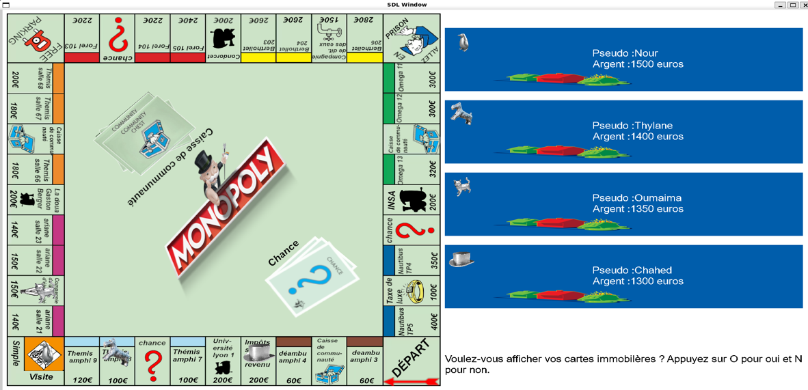
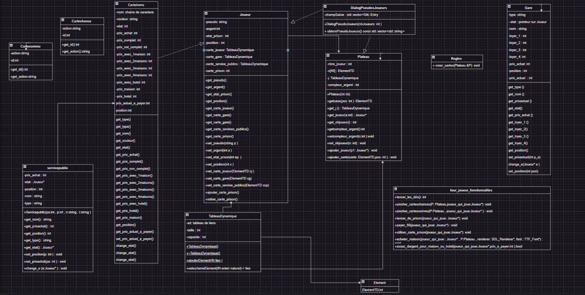

# Monopoly lyon 1

## Lancement de l'application

L'application Monopoly Lyon 1 est compilée grâce à un makefile. 

- Afin de lancer l'application, effectuer tout d'abord un ``make clean` afin de nettoyer les fichier objets et l'éxécutable.
- Ensuite effectuer un `make`. Pour compiler.
- Pour finir lancer l'application avec : `./bin/Jeu`

Afin d'assurer le bon déroulement de l'application 3 bibliothèques doivent être installées : 

- SDL2 avec la commande `sudo apt install libsdl2-2.0` (sous ubuntu), puis `sudo apt install libsdl2-dev` pour les packages de développement. Si jamais mixer.h n'est pas reconnu, `sudo apt install libsdl2-mixer-2.0`.

- Gtkmm, utilisé dans Demander_pseudo.cpp avec la commande : `sudo apt install libgtkmm-3.0-dev` (sous ubuntu).

- Json avec la commande : `sudo apt install nlohmann-json3-dev` (sous ubuntu).

## But de l'application
Notre projet consiste à développer une application du jeu Monopoly en utilisant le langage C++. Le Monopoly est un jeu de société classique qui implique des transactions immobilières, l'utilisation de cartes chance, et la mise en œuvre de stratégies financières. Nous avons choisi de créer une version numérique du Monopoly pour offrir aux joueurs une expérience plus accessible et interactive, tout en conservant le charme du jeu original.

Ce qui rend notre projet unique, c'est notre idée d'intégrer les bâtiments de l'université Lyon 1 à la place des noms de rues habituels. Cette approche ajoute une touche de personnalisation et de familiarité locale au jeu, permettant aux joueurs de se retrouver dans un environnement qu'ils connaissent et apprécient peut-être déjà. En remplaçant les noms de rues par des bâtiments universitaires, nous espérons également encourager l'exploration et la découverte de l'université Lyon 1, tout en offrant une expérience de jeu unique et divertissante.

## Fonctionnalités de l'application
L'application Monopoly Lyon 1, diffère en quelques points de l'application Monopoly original, même si elles restent très proches.
Voici le déroulement de notre application
- Pour commencer, les utilisateurs ont le choix du nombre de joueurs de 2 à 4, ils peuvent ensuite entrer leur pseudo.
- Une fois le jeu lancé les joueurs jouent chacun leur tour, ils ont pour commencer le choix d'afficher les cartes qu'ils possèdent puis ils lancent les dés. Ils peuvent tomber sur différents types de cases : 

#### Les cases immobilières
Quand un joueur tombe sur une case immobilière, la majorité des cases présentent, soit la case n'est pas achetée, si le joueur a assez d'argent, il a le choix de l'acheter ou non et donc d'en faire sa propriété. S'il décide de l'acheter, il faut vérifier s'il possède le groupe complet, car le prix change si c'est le cas.
Ou la case est déjà achetée dans ces cas là il paye au joueur qui possède la case le prix du loyer en cours. Ou si c'est lui qui possède la case, il a le choix de mettre d'acheter une maison pour augmenter le loyer de la case, il peut une fois les 4 maisons obtenues, mettre un hôtel le plus haut loyer.

#### Les cases gare
Même principe que les cases immobilières, seulement il n'y a pas de principe de maisons et d'hôtels. 

#### Les cases services publics
Encore une fois le principe de posséder la case, seulement si un joueur possède une des deux cartes, quand un joueur tombe sur son service public il lance les dés, et il paye le résulat des dés multiplié par 4.
Si un joueur possède les 2 cartes quand un joueur tombe sur un des deux services publics il lance les dés, et il paye le résulat des dés multiplié par 10.

#### Les taxes de luxe et impôts sur le revenu
Le joueur paye 100€, pour les taxes de luxe ou 200€ pour l'impôt sur le revenu est cette somme est placée au milieu du jeu.

#### Parc gratuit
Le joueur récupére l'argent qu'il y a au milieu s'il y en a.

#### Cartes caisse communautaire et Cartes chance
Le joueur pioche une carte chance et caisse communautaire et effectue l'action qu'il y a sur la carte.

#### Visite prison
Le joueur visite la prison, il ne se passe rien.

#### Aller en prison
Le joueur va directement en prison, sans passer par la case départ.

#### Case départ
Si le joueur passe la case départ ou s'il tombe dessus, il touche 200€.

### Comment gagner ?
Pour gagner la partie, il faut être le dernier à avoir son argent en positif, c'est pourquoi il est important d'établir une stratégie pour utiliser intelligemment son argent.

## Structure de fichiers

Le projet est structuré en plusieurs dossiers : 

### bin
Le dossier de l'éxécutable Jeu.

### data
Ce dossier contient les 3 fichiers json d'initialisation des données. 
- Carte_chance.json
- Carte_commu.json
- Carte.json

Il contient aussi tous les fichiers graphiques tels que les images des cartes immobilières, chances, communautaires. Les images des pions des joueurs, les menus. Ainsi que la musique de fond du jeu.

Il contient un dossier appelé dice qui stock les 59 images `.bmp` qui composent l'animation de lancer de dés. 

### doc 
Ce dossier contient la présentation de la soutenance en .`pptx` ainsi que le PDF. Il stock aussi la doc réalisée avec doxygen.

### obj 
Contient les fichiers objets générés au moment de la compilation avec le makefile.

### src 
Contient les fichiers sources du code notamment les `.h` et les `.cpp`

## Structure des données

### Les classes
Toutes les classes possèdent les fonctions set et get pour leur données qui sont toutes en privé.

## Diagramme des classes

Voici le diagramme des classes de l'application :

#### Tableau Dynamique
Cette classe définie un Tableau dynamique composé de : 
- `unsigned int capacité` : La capacité du tableau
- `unsigned int taille_utilisee` : La taille utilisée du tableau
- `ElementTD * ad` : Un pointeur de type ElementTD sur un tableau stocké sur le tas

#### Joueur
Cette classe définie un Joueur composé de :
- `string pseudo` : Le pseudo du joueur
- `int argent` : L'argent du joueur
- `int etat_prison` : Un entier qui prend les valeurs de 0 à 3 et qui détermine combien de tours le joueur doit encore rester un prison. Si c'est égal à 0 le joueur n'est donc pas en prison
- `int position` : L'indice de position du joueur de 0 (Case départ) à 39 (Dernière case)
- `TableauDynamique carte_joueur` : Un tableau dynamique des cartes immobilières que possède le joueur
- `TableauDynamique carte_gare`: Un tableau dynamique des cartes gare que possède le joueur
- `TableauDynamique carte_services_publics` : Un tableau dynamique des cartes services publics que possède le joueur
- `int carte_prison` : Un entier qui compte le nombre de carte *libéré de prison* du joueur
- `int position_x` : La position x graphique du joueur
- `int position_y` : La position y graphique du joueur
- `int joueur_neg` : Un entier qui prend 0 ou 1. Initialisé à 0 et quand le joueur à son argent en négatif cet état passe à 1 et le joueur ne peut plus jouer

#### Cartes communautaires et Cartes chances (Cartecommu et Cartechance)
- `string action` : Défini l'action lié à la carte piochée
- `int id` : un entier qui identifie chaque carte pour faciliter l'initialisation avec le fichier json

#### Gare
- `string type` : Type qui permert de faciliter l'initialisation de la carte grâce à son type
- `Joueur*etat` : Un pointeur sur le joueur qui possède la carte. Il est égal à `nullptr` si la carte n'appartient à personne  
- `string nom` : Le nom de la gare
- `int loyer_1` : Le loyer si le joueur possède une gare
- `int loyer_2`: Le loyer si le joueur possède deux gares
- `int loyer_3`: Le loyer si le joueur possède trois gares
- `int loyer_4`: Le loyer si le joueur possède quatre gares
- `int prix_achat`: Le prix d'achat de la carte
- `int position`: La position sur le plateau
- `int prix_actuel`: Le prix actuel, c'est-à-dire, si un joueur tombe sur cette case combien il doit payer

#### Service publics (Servicepublic)
- `int prix_achat`: Le prix d'achat de la carte
- `Joueur*etat`:Un pointeur sur le joueur qui possède la carte. Il est égal à `nullptr` si la carte n'appartient à personne  
- `int position`: La position sur le plateau
- `string nom`: Le nom du service public
- `string type`: Type qui permert de faciliter l'initialisation de la carte grâce à son type

#### Carte immobilières (CarteImmo)
- `string type `: Type qui permert de faciliter l'initialisation de la carte grâce à son type
- `string nom ` : Le nom de la propriété immobilière
- `string couleur`: La couleur de la carte, *son groupe*
- `Joueur* etat`: Un pointeur sur le joueur qui possède la carte. Il est égal à `nullptr` si la carte n'appartient à personne  
- `int prix_achat`: Le prix d'achat de la carte
- `int prix_complet`: Le prix si le joueur possède le groupe complet
- `int prix_non_complet` : Le prix si le joueur ne possède pas le groupe complet
- `int prix_1maison `: Le prix si le joueur possède une maison sur la propriété
- `int prix_2maisons`: Le prix si le joueur possède deux maisons sur la propriété
- `int prix_3maisons`: Le prix si le joueur possède trois maisons sur la propriété
- `int prix_4maisons`:Le prix si le joueur possède quatre maisons sur la propriété
- `int prix_avec_hotel`: Le prix si le joueur possède un hôtel sur la propriété
- `int prix_maison`: Le prix d'achat d'une maison sur cette propriété
- `int prix_hotel`: Le prix d'achat d'un hôtel sur cette propriété
- `int prix_actuel_a_payer`: Le prix actuel, c'est-à-dire, si un joueur tombe sur cette case combien il doit payer
- `int position`: La position sur le plateau

#### Plateau
- `int nbre_joueur`: Le nombre de joueur dans la partie
- `ElementTD c[40]`: Un tableau d'ElementTD est initialisé grâce au fichier json et qui contient les 40 pointeurs `void *` cases du tableau
- `TableauDynamique j`: Le tableau dynamique de joueur
- `int compteur_argent`: Le compteur d'argent qu'il y a au milieu

### Le reste des fichiers

#### ElementTD.cpp ElementTD.h
Ce fichier définie un type ElementTD qui est un pointeur générique dont le code a beaucoup besoin, cette utilitée sera expliquée lors de la soutenance, mais aussi plus bas.

#### Caisse_fonctions.cpp Caisse_fonctions.h
Déclarations des fonctions associées à des cartes caisse communautaires particulières. 

#### Chance_fonctions.cpp Chance_fonctions.h
Déclarations des fonctions associées à des cartes chances particulières.

#### Accueil.cpp Accueil.h
Le fichier .cpp défini de nombreuses fonctions qui sont utilisé en interne par le fichier .cpp, la seule fonction accessible dans les autres fichiers est `int Choix_nombre_joueurs()` qui permet à la fois d'afficher le premier menu, 
ainsi que faire le lien avec le deuxième menu avec la fonction `choisirNombreJoueurs()`définie dans Menu_nb_joueurs.cpp.

#### Menu_nb_joueurs.cpp Menu_nb_joueurs.h
Ces fichiers initialisent la fonction `int choisirNombreJoueurs()` pour afficher le deuxième menu est faire un choix sur le nombre de joueurs, *entre 2 et 4*.

#### Affichage.cpp Affichage.h
Ces fichiers initialisent les fonctions d'affichages du jeu qui sont utilisé à des moments précis dans le codes, comme void `afficher_jeu_static(Plateau &P, SDL_Renderer* renderer, TTF_Font* font)` ou encore `void afficher_commentaire(Plateau &P, SDL_Renderer* renderer, TTF_Font* font, const string& commentaire, int duree_affichage_ms)`.
Il initialise aussi les fonctions d'initialisation et de nettoyage de la fenêtre SDL.

#### Fonctionnalités_Monop.cpp Fonctionnalités_Monop.h
Ce fichier liste toutes les fonctions utilent pendant le tour d'un joueur, qui ont permit en quelque sorte de factoriser le code. Ainsi qu'une fonction `void tout_supprimer(Plateau &P)` qui supprime la mémoire allouée dynamiquement à la fin de la partie.

#### Demander_pseudo.cpp Demander_pseudo.h
Fichier qui utilise la bibliothèque Gtkmm pour récupérer les pseudos des joueurs de la partie.

#### Tour_joueur.cpp Tour_joueur.h
Ces fichiers initialisent les deux fonctions les plus importantes du jeu. `int tour_joueur(Plateau &P, Joueur* joueur_qui_joue, SDL_Renderer* renderer, TTF_Font* font, int numero_du_joueur)` est la fonction qui à partir d'un joueur donné (celui qui à qui c'est au tour de jouer), lui permet de faire son tour, lancer les dés, tester sur quelle case il vient de tomber, et exécuter les fonctions en lien avec cette case.

## Explications de certains choix et de difficultés rencontrées

### Utilisation de pointeurs génériques
Au vu du nombre de données diiférentes, tels que les différents types de cartes (immobilière, gare, services publics...), il nous fallait un moyen général pour accéder à ces données, c'est pourquoi nous avons utilisé `void *`. Avec l'utilisation des `static_cast` tel que : 
- `CarteImmo* carte_associée_a_la_pos = static_cast<CarteImmo*>(static_cast<void*>(case_du_joueur));`
On a par exemple ici récupérer la carte immobilière associée à la position du joueur, la `case_du_joueur` étant initialisée comme un ElementTD : `ElementTD case_du_joueur = P.getcase(joueur_qui_joue->get_position());` 
On a pu utiliser `static_cast` car on était sûr que le pointeur génénique pointait vers une carte immobilière.
Cette structure de données a été l'une des premières difficulté que nous avons rencontré, car nous n'avions jamais utilisé `static_cast` auparavant. Nous avions plusieurs fois utilisé le `static_cast` d'une mauvaise manière qui nous provoquait des erreurs que nous ne comprenions pas.

Après notre maîtrise, ces pointeurs génériques se sont finalement révélés très pratique sinon il était impossible pour nous de faire un tableau pour représenter le plateau, les structures de données qui le compose étant très différentes.

### Utilisation des fichiers json
Dans un Monopoly il y a de nombreuses données à stocker, c'est pourquoi nous nous sommes tournées vers l'utilisation de fichiers json. Des fichiers un peu long à initialiser mais permettent une création simple et efficace des cartes qui composent le plateau. 
C'était la première fois que nous utilisions cette bibliothèque. Nous n'avons pas eu de problème quant à son utilisation.

### Utilisation de la bibliothèque Gtkmm
Un des difficultés graphique que nous avons rencontré est la récupération des pseudos des joueurs qu'il peuvent entrer directement dans la fenêtre graphique. Après de nombreuses tentatives infructueuses en SDL, nous nous sommes tournées vers GTK, c'était une première pour nous, on a trouvé que cette bibliothèque était bien plus dure à utiliser que SDL. 

### éléments graphiques du jeu
Nous avons décidé, afin d'apporter un peu d'originalité à l'application, de faire un monopoly en remplaçant le nom des propriétés originales du Monopoly par des salles ou des amphis en rapport avec l'Université Lyon 1. Cependant, cela à ajouter de nombreuses heures de travail à modifier les noms des propriétés sur le plateau et sur chaque cartes immobilières et gares du jeu. De plus, nos cartes chances et nos cartes communautaires étant aussi dans le thème, il a fallu les modifier elles aussi une par une.

### Un nombre de données et de possessions des joueurs en constante évolution 
Le Monopoly est un jeu où les joueurs doivent posséder des propriétés et où l'état des joueurs et les variables associées changent constamment. Après un certain temps nous nous sommes rendues compte qu'il fallait faire en sorte que les joueurs puissent avoir une vues d'ensemble de leur jeu. C'est pourqquoi nous avons mis en place de nouvelles fonctionnalités telles que l'affichage des cartes possédées à chaque début de tour si le joueur le souhaite.

### "des flashs" qui apparaissent à chaque changement dans la fenêtre SDl
Vu que c’est impossible d’enlever juste un element de la fênetre SDL et laisser le reste intact , la fênetre se redessinait après chaque action graphique ce qui rendait l’affichage laid et lent. On a opté pour coder par exemple une fonction (effacer_commentaire )qui dessine un rectangle blanc vide et l’appeler à la fin du code de notre fonction qui affiche le commentaire au lieu d’un RenderClear.On a fait le même raisonnement pour les autres "flashs".

### Lire un fichier BMP pour afficher une vidéo 
Pour rajouter plus d'animation, on avait décidé de rajouter une vidéo d'un dé qui se lance à chaque lancée de dé pour chaque joueur . Vu qu'on n'y connaissait pas , on a eu un problème avec le type de fichier qu'on devait mettre et on avait pas croisé le type BMP auparavant. Après plusieurs essais echoués avec mp4 on s'est rendu compte que le fichier BMP est le seul que SDL prend en compte et qu'il contient une succesion d’images qui forment la vidéo et qui est chargé sequentiellement .

## Les ameliorations qu'on aurait aimé faire si on avait plus de temps 
On s'est concentré plutôt sur le fonctionnement impecable du jeu . 
### Quitter la fenêtre SDL à tout moment 
À chaque fois qu'on voulait quitter le jeu lors d'une action ; il fallait attendre que l'action soit finie pour qu'on puisse sortir (grâce à un SDL_Quit ) . On envoyait un signal SIGKILL au processus quand on voulait arrêter le jeu à n'importe quel moment . Nous avons eu l'idée de coder un gestionnaire de signal qui envoie le signal au processus automatiquement quand on clique sur la croix mais ça renvoyait toujours une erreur de ségmentation qu'on a pas réussi à régler .
### Joueur ordinateur
On voulait faire un joueur ordinateur pour que 1 joueur puisse jouer avec lui-même , mais vu qu'on a rajouté plus de fonctions d'animations , on a abandonné cette idée parcequ'on était préssées par le temps  .

