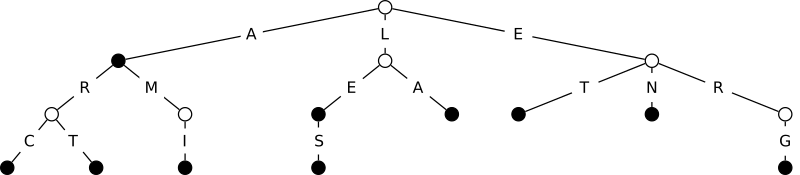

# Projet Scrabble


## Introduction

Le but de ce projet est la programmation d'un joueur automatique au Scrabble, qui déterminera le coup rapportant le plus de points étant donné un plateau de jeu, l'ensemble des lettres du joueur, et un dictionnaire. Vous pourrez retrouver les règles du jeu et des tutoriels [facilement sur le web](https://duckduckgo.com/?q=scrabble+how+to+play&t=h_&ia=web).

Ce projet s'appuie sur la structure de **GADDAG** qui permet de déterminer efficacement, étant donné un point de départ sur le plateau, les mots qui peuvent être ajoutés en passant par ce point.

## Fonctionnalités du Projet

### Gestion du Sac de Lettres

Le programme gère un sac de lettres contenant les lettres et leurs valeurs en points. Chaque joueur dispose de 7 lettres, et le sac peut être rechargé en fonction des lettres restantes.

### Structure de données GADDAG

Le projet implémente un dictionnaire basé sur la structure de données **GADDAG** pour effectuer des recherches rapides sur les mots valides qui peuvent être joués sur le plateau.

### Calcul du Meilleur Coup

Le programme évalue toutes les options de jeu possibles et détermine le coup qui rapportera le plus de points en tenant compte des lettres du joueur et des mots existants sur le plateau.

## Lancer le projet

### Prérequis

Avant de commencer, assurez-vous d'avoir installé **CMake** et un compilateur C++ sur votre machine. Vous pouvez vérifier l'installation de **CMake** en exécutant la commande suivante dans votre terminal :

```bash
cmake --version
````

Si **CMake** est installé, cela affichera sa version. Sinon, vous pouvez l'installer à partir de [CMake.org](https://cmake.org/install/).

### Compilation et Exécution

1. **Création du répertoire de compilation (build)**

   Créez un répertoire `build` dans lequel les fichiers de compilation seront générés.

   ```bash
   mkdir build
   cd build
   ```

2. **Configuration avec CMake**

   Une fois dans le répertoire `build`, exécutez la commande suivante pour configurer le projet et générer le Makefile :

   ```bash
   cmake ..
   ```

3. **Compilation avec Make**

   Après avoir généré le Makefile avec CMake, compilez le projet en utilisant `make` :

   ```bash
   make
   ```

4. **Exécution des tests**

   Une fois la compilation terminée, vous pouvez exécuter le programme avec la commande suivante pour tester le projet :

   ```bash
   ./test_board
   ```

## Structure du Projet

Le projet est structuré de la manière suivante :

* **CMakeLists.txt** : Le fichier de configuration utilisé pour gérer la compilation avec **CMake**.
* **src/** : Contient les fichiers sources du projet, y compris les implémentations des classes pour le plateau, les joueurs, et la gestion du dictionnaire.
* **data/** : Contient des données nécessaires au jeu comme le dictionnaire (`dico.txt`), les images ou autres fichiers de ressources.
* **include/** : Contient les fichiers d'en-têtes pour la déclaration des classes et des fonctions.

### Classes Principales

* **Board** : Représente le plateau de jeu.
* **Player** : Représente un joueur avec ses lettres et son score.
* **Gaddag** : Structure de données pour gérer le dictionnaire et la recherche de mots valides.
* **Sac** : Gère le sac de lettres du jeu.
* **Joueur** : Gère les actions du joueur, y compris l'ajout de lettres et le calcul du score.

## Structures de Données

### GADDAG : Arbre de Dictionnaire

Le **GADDAG** (Generalized Acyclic Directed Acyclic Graph) est une structure de données clé pour ce projet. Il est utilisé pour stocker le dictionnaire du Scrabble et permet de rechercher rapidement les mots valides pouvant être joués à partir d'une position donnée sur le plateau.

#### Insertion dans le GADDAG

L'insertion d'un mot dans le GADDAG se fait lettre par lettre. Si une arête correspondant à une lettre n'existe pas, une nouvelle arête et un nouveau nœud sont créés. Le nœud terminal marque la fin d'un mot valide. Si une arête existe déjà pour une lettre donnée, on passe au nœud suivant.

#### Recherche dans le GADDAG

La recherche d'un mot consiste à parcourir l'arbre en suivant les arêtes correspondant aux lettres du mot. Si le mot existe dans le dictionnaire, la recherche s'arrête à un nœud terminal.

### Sac de Lettres

Le sac de lettres est une structure qui contient toutes les lettres utilisées pour le jeu, avec leurs quantités respectives. Chaque lettre a une probabilité de tirage proportionnelle à sa fréquence d'apparition dans le sac. Cette structure permet de piocher une lettre au hasard en temps constant.

### Lettres du Joueur

Chaque joueur dispose de 7 lettres à sa disposition, et sa main de lettres est rechargée à chaque tour en piochant des lettres dans le sac. La structure des lettres permet de gérer l'ensemble des lettres du joueur et de faciliter les opérations de mise à jour de la main de lettres.

### Calcul des Points

Le programme attribue une valeur en points à chaque lettre, conformément aux règles du Scrabble. Les points sont utilisés pour évaluer chaque coup possible et déterminer celui qui maximise le score du joueur.

## Exemple de GADDAG



## Recherche et Placement des Mots

### Recherche de Mots par le Milieu

Le GADDAG est adapté pour chercher des mots qui se forment à partir de lettres déjà présentes sur le plateau, ce qui est essentiel dans le Scrabble. Le mot est recherché en partant du milieu, c'est-à-dire en utilisant une lettre déjà présente sur le plateau et en explorant dans les deux directions (horizontale et verticale).

### Placement des Mots

Lorsqu'un nouveau mot est joué, il doit réutiliser au moins une lettre déjà présente sur le plateau. Le programme permet de vérifier la validité du mot en s'assurant qu'il est formé uniquement avec des lettres valides et qu'il croise les mots existants conformément aux règles du Scrabble.

## Conclusion

Ce projet permet de créer un joueur automatique pour le jeu de Scrabble en utilisant des structures de données efficaces telles que le **GADDAG**. L'algorithme permet de déterminer rapidement le meilleur coup possible et de garantir un jeu fluide.

